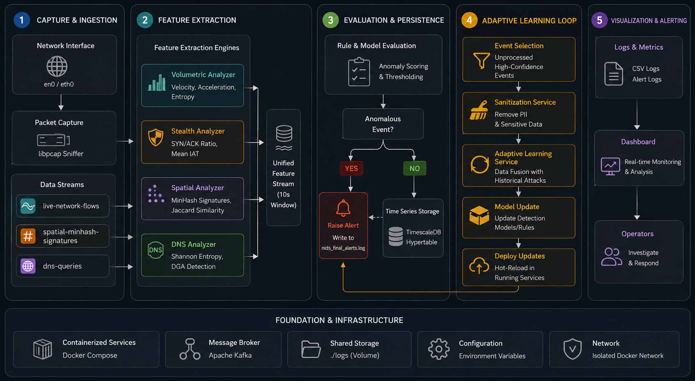

# Autonomous Machine Learning-Based Network Intrusion Detection System (NIDS) Pipeline
[](https://opensource.org/licenses/MIT)
[](https://www.python.org/downloads/release/python-3100/)
[](https://docs.docker.com/compose/)
[](https://www.timescale.com/)
An enterprise-grade, real-time, self-adaptive Network Intrusion Detection System (NIDS) pipeline. This system leverages network sniffers, Kafka message brokers, streaming feature extraction engines, kinematic residual analysis, deep learning, and a closed-loop database-driven adaptive learning mechanism to detect, classify, and adapt to network threats in real time.
---
## Table of Contents
1. [System Architecture](#system-architecture)
2. [Core Detection Methodologies](#core-detection-methodologies)
   - [Kinematic Residual Analysis](#1-kinematic-residual-analysis)
   - [Stateful Flow Tracking](#2-stateful-flow-tracking)
   - [Spatial Correlation via MinHash](#3-spatial-correlation-via-minhash)
   - [DNS DGA Detection via Shannon Entropy](#4-dns-dga-detection-via-shannon-entropy)
3. [Closed-Loop Adaptive Learning](#closed-loop-adaptive-learning)
4. [Project Directory Layout](#project-directory-layout)
5. [Prerequisites & Setup](#prerequisites--setup)
6. [Deployment & Running](#deployment--running)
7. [Database Telemetry & Management](#database-telemetry--management)
8. [Telemetry Dashboard](#telemetry-dashboard)
9. [Troubleshooting](#troubleshooting)
---
## System Architecture
The pipeline is built on a decoupled, microservices-oriented architecture using Docker Compose. The flow of data travels from the raw network interface to live alerts and a real-time visualization dashboard:

---
## Core Detection Methodologies
The pipeline leverages multiple detection vectors to identify diverse threat types, ranging from high-bandwidth DDoS floods to low-and-slow port scans and botnet coordination:
### 1. Kinematic Residual Analysis (Volumetric Anomaly Detection)
* **Logic Location**: Implemented in [`src/Consumer_Vol_kafka.py`](src/Consumer_Vol_kafka.py) and [`src/non_linear.py`](src/non_linear.py).
* **Concept**: Captures volumetric changes in network flow statistics (Bytes/sec, Packets/sec, and Mean Packet Length).
* **Mathematical Approach**:
  - A pre-trained Polynomial Regression model predicts the expected total byte volume ($T_{vol}$) based on the number of requests ($N_{req}$) and packet length ($S_{len}$).
  - Renyi and Shannon entropy are calculated over moving windows to inspect data stability.
  - The difference between predicted volume and actual volume yields a **residual**.
  - The system computes the first derivative (**Velocity**) and second derivative (**Acceleration**) of this residual:
    $$\text{Velocity } (v) = R(t) - R(t-1)$$
    $$\text{Acceleration } (a) = v(t) - v(t-1)$$
  - Rapid spikes in residual velocity or acceleration indicate anomalous network activity, such as traffic bursts or floods.
### 2. Stateful Flow Tracking (Stealth Anomaly Detection)
* **Logic Location**: Implemented in [`src/Consumer_St_kafka.py`](src/Consumer_St_kafka.py) and [`src/libpcap_approach.py`](src/libpcap_approach.py).
* **Concept**: Inspects TCP packet structures and protocol states per source IP.
* **Extracted Features**:
  - **SYN/ACK Ratio**: Tracks the ratio of SYN flags to ACK flags. A high SYN/ACK ratio indicates potential SYN Flood DDoS attacks.
  - **Inter-Arrival Time (IAT)**: Measures the average time elapsed between consecutive packets in a flow. Abnormal IAT averages or high variations can reveal automated beaconing, scraping, or C2 communication channels.
### 3. Spatial Correlation via MinHash (Coordinated Scan / Botnet Detection)
* **Logic Location**: Implemented in [`src/Consumer_Spatial.py`](src/Consumer_Spatial.py) and [`src/libpcap_approach.py`](src/libpcap_approach.py).
* **Concept**: Identifies coordinated botnet activity or distributed port scans targeting common destination ports (e.g., HTTP Port 80).
* **Mathematical Approach**:
  - Utilizes **MinHash Signatures** (with $k=128$ independent hashing functions) to compress the set of unique source IPs communicating with a target port.
  - Computes the **Jaccard Similarity Coefficient** between subsequent signatures over sliding time frames:
    $$J(A, B) = \frac{|A \cap B|}{|A \cup B|}$$
  - A Jaccard similarity score exceeding a defined threshold (default: `0.70`) implies a high spatial correlation of IPs targeting the port, signifying a coordinated botnet or distributed scanning attack.
### 4. DNS DGA Detection via Shannon Entropy (Command & Control Detection)
* **Logic Location**: Implemented in [`src/Consumer_Spatial.py`](src/Consumer_Spatial.py) and [`src/non_linear.py`](src/non_linear.py).
* **Concept**: Detects Domain Generation Algorithms (DGA) used by malware to establish dynamic Command and Control (C2) connections.
* **Mathematical Approach**:
  - Extracts queried domain names from UDP Port 53 DNS payloads.
  - Computes the **Shannon Entropy** of the core domain:
    $$H(X) = -\sum_{i=1}^{n} P(x_i) \log_2 P(x_i)$$
  - Randomly generated DGA domains have significantly higher Shannon entropy than natural language domain names due to their high character dispersion.
---
## Closed-Loop Adaptive Learning
To combat network environment drift (concept drift) and minimize false positives, the system implements a continuous self-adaptation loop:
1. **Aggregation & Evaluation**: The [`src/Consumer_MLP.py`](src/Consumer_MLP.py) microservice aggregates the six metrics (`[velocity, acceleration, iat_mean, sa_ratio, jaccard_score, entropy_shannon]`) over 10-second intervals per source IP. Features are normalized via a scaler and classified via a Multi-Layer Perceptron (MLP) Classifier.
2. **Database Ingestion**: All records (metrics, classification outputs, anomaly probabilities) are saved in a **TimescaleDB Hypertable** optimized for time-series data.
3. **Data Sanitization**: The [`src/sanitization_service.py`](src/sanitization_service.py) queries the database every 60 seconds to pull unprocessed events meeting confidence thresholds:
   - **Highly Confident Benign**: Anomaly probability $\le 0.15$
   - **Highly Confident Anomaly**: Anomaly probability $\ge 0.85$
   - **Self-Traffic**: Traffic belonging to the host IP is automatically labeled as Benign (`0`) to prevent self-positives.
   - Filtered samples are saved to disk as a new training batch (`models/features/adaptive_batch.npz`).
4. **Adaptive Retraining**: The [`src/adaptive_learning.py`](src/adaptive_learning.py) daemon fuses the newly collected database batch with baseline historical data (`models/historical_attacks.npz`). It performs class balancing (undersampling attacks to match benign counts), shuffles the dataset to avoid catastrophic forgetting, retrains a new MLP Classifier, and dumps the updated model and scaler to the disk.
5. **Zero-Downtime Hot-Reload**: [`src/Consumer_MLP.py`](src/Consumer_MLP.py) tracks the model file modification timestamp. When a new model is written by the retraining daemon, the weights and scaler are hot-reloaded into memory on-the-fly, ensuring uninterrupted network monitoring.
---
## Project Directory Layout
```align
├── Dockerfile.consumer         # Container configuration for consumer/ML services
├── Dockerfile.frontend         # Container configuration for Streamlit dashboard
├── Dockerfile.producer         # Container configuration for libpcap sniffer
├── docker-compose.yml          # Core microservice orchestration setup
├── database.txt                # Reference file containing SQL troubleshooting queries
├── config/                     # Dependencies lists
│   ├── requirements.txt
│   ├── requirements-consumer.txt
│   └── requirements-producer.txt
├── database/                   # Database schemas
│   └── events.sql              # Table & hypertable setup script
├── logs/                       # Local directory for generated logs (mounted as volumes)
│   ├── residual_metrics.csv
│   ├── stealth_metrics.csv
│   ├── spatial_metrics.csv
│   ├── dns_metrics.csv
│   └── nids_final_alerts.log   # Final neural network threat alerts
├── models/                     # ML models, scaler states, and datasets
│   ├── features/
│   │   └── adaptive_batch.npz  # Sanitized database events saved for retraining
│   ├── historical_attacks.npz  # Baseline training samples
│   ├── nids_mlp_model.joblib   # Base MLP weights (read-only)
│   ├── nids_scaler.joblib      # Base scaler weights (read-only)
│   ├── mlp_model.joblib        # Active (hot-reloaded) model weights
│   └── scaler.joblib           # Active (hot-reloaded) scaler weights
├── src/                        # Main codebase
│   ├── Producer_kafka.py       # Captures packets & dispatches to Kafka topics
│   ├── libpcap_approach.py     # Low-level packet parser using libpcap
│   ├── Consumer_Vol_kafka.py   # Volumetric kinematics extractor
│   ├── Consumer_St_kafka.py    # Stateful flow metrics extractor
│   ├── Consumer_Spatial.py     # MinHash Jaccard and DNS Shannon entropy extractor
│   ├── Consumer_MLP.py         # AI inference engine, db publisher & hot-reloader
│   ├── sanitization_service.py # Sanitizes database events into training files
│   ├── sanitization_logic.py   # Logic query mapping for high-confidence samples
│   ├── adaptive_learning.py    # Merges data, balances classes & retrains model
│   ├── non_linear.py           # Helper libraries for kinematics & entropy equations
│   └── frontend_app.py         # Streamlit telemetry visualization web page
└── topical_src/                # Legacy/sandbox research code
```
---
## Prerequisites & Setup
1. **Docker**: Install Docker and Docker Compose.
2. **Network Interface Permissions**: Since the producer sniffs raw network packets in `"host"` network mode, you must ensure that your host system allows packet capturing on your selected interface.
3. **Environment Setup**:
   Create a `.env` file in the root directory (or pass them directly) containing:
   ```bash
   INTERFACE=any       # Network interface to capture from (e.g. eth0 on Linux, en0 on macOS)
   HOST_IP=<host_ip> # Local IP address of your host machine (e.g. ifconfig on MacOs or ip a on Linux)
   ```
---
## Deployment & Running
Start all services in detached mode with Docker Compose. This automatically compiles the docker files, initializes Zookeeper, Kafka, TimescaleDB, starts the network sniffer, starts all streaming feature consumers, initializes the AI evaluator, launches the background training daemons, and boots up the user interface:
```bash
docker compose up --build -d
```
To view running containers:
```bash
docker compose ps
```
To stream service logs:
```bash
docker compose logs -f
```
To tear down the stack (retaining TimescaleDB volume data):
```bash
docker compose down
```
---
## Database Telemetry & Management
TimescaleDB automatically starts and initializes the SQL schema from [`database/events.sql`](database/events.sql). 
### Accessing the Database CLI
Exec into the running TimescaleDB container using the following command:
```bash
docker exec -it ids-timescaledb psql -U postgres
```
### Useful SQL Commands (from `database.txt`)
Inside the database prompt, run these queries to check system operations:
* **Show Database Tables**:
  ```sql
  \dt
  ```
* **Inspect Table Schema**:
  ```sql
  \d network_traffic_events
  ```
* **Count Total Received/Written Event Windows**:
  ```sql
  SELECT COUNT(*) FROM network_traffic_events;
  ```
* **Check the 5 Latest Evaluated Windows**:
  ```sql
  SELECT time, source_ip, probability, prediction 
  FROM network_traffic_events 
  ORDER BY time DESC 
  LIMIT 5;
  ```
* **View Active Alerts (Malicious predictions)**:
  ```sql
  SELECT time, source_ip, probability 
  FROM network_traffic_events 
  WHERE prediction = 1 
  ORDER BY time DESC;
  ```
* **Count Unprocessed Events Awaiting Sanitization**:
  ```sql
  SELECT COUNT(*) FROM network_traffic_events WHERE is_processed = FALSE;
  ```
---
## Telemetry Dashboard
The dashboard provides a real-time web portal to monitor system diagnostics and critical alerts.
1. Open your browser and navigate to `http://localhost:8501`.
2. The dashboard offers:
   - **System Status Indicators**: Online/Offline status flags for consumers and active components.
   - **Real-Time Kinematic Error Analysis Chart**: Interactive graphs showing Velocity and Acceleration vs. Time, compared with the paper-defined thresholds.
   - **AI Threat Level Gauge**: Visual indicator showing the threat confidence percentage for incoming traffic.
   - **Active Alert log**: Displays real-time critical warnings detailing the source IP address and corresponding anomaly probability.
---
## Troubleshooting
* **No traffic being captured**: Verify the `INTERFACE` setting. On macOS, run `ifconfig` to find your active interface (e.g. `en0`). On Linux, run `ip link show` (e.g. `eth0` or `wlan0`). Ensure you run Docker with appropriate permissions (network mode `"host"` and privileged mode are enabled in `docker-compose.yml`).
* **Kafka broker connection issues**: If consumers cannot connect, verify that Kafka is healthy:
  ```bash
  docker compose ps
  ```
  Zookeeper and Kafka must show `healthy`.
* **Database Connection errors in Consumers**: The TimescaleDB service takes a few seconds to run migrations. The services are configured with `depends_on` and service health checks, but if a connection drops, containers are configured with `restart: unless-stopped` to automatically retry.
---
## License
This project is licensed under the MIT License. See the `LICENSE` file for details.
